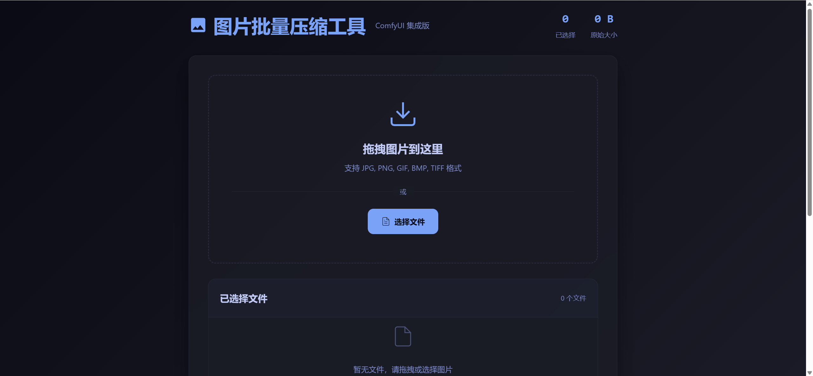

# ComfyUI Batch Image Compressor

[English Version](README_en.md) | [中文版](README.md)

> This project was primarily written with the help of AI, and has been reviewed and approved by the author with no major issues, which is why it has been published on GitHub.

This is a Flask-based web application designed as a batch image compression tool for ComfyUI users. It supports multiple image formats, provides high-quality compression options, and preserves image metadata and workflow information.

## UI界面预览



## Features

- **Batch Processing**: Support uploading and compressing multiple image files simultaneously
- **Drag & Drop Upload**: Support dragging folders or multiple files for upload
- **Multi-format Support**: Support common image formats including PNG, JPG, JPEG, GIF, BMP, TIFF
- **Adjustable Compression**: Customizable JPEG quality, optimization options, and progressive JPEG
- **Real-time Preview**: Display file size comparison and compression ratio before and after compression
- **Metadata Preservation**: Extract and save image metadata and ComfyUI workflow information
- **Flexible Download**: Support individual or batch download of compressed files
- **Modern Interface**: Modern dark theme design with responsive layout

## Quick Start

### Requirements

- Python 3.7+
- Flask
- Pillow
- Werkzeug

### Installation

For Windows users, we provide convenient batch scripts and PowerShell scripts that novice users can simply double-click to run:

1. Clone the repository:
   ```bash
   git clone <repository-url>
   cd comfyui_outputImage_compressor
   ```

2. Install dependencies:
   - Method 1 (Command Line):
     ```bash
     pip install -r requirements.txt
     ```
   - Method 2 (Windows Novice Friendly):
     Double-click to run `install_dependencies.bat` or `install_dependencies.ps1`

3. Run the application:
   - Method 1 (Command Line):
     ```bash
     python main.py
     ```
   - Method 2 (Windows Novice Friendly):
     Double-click to run `start_app.bat` or `start_app.ps1`

4. Access `http://localhost:5000` in your browser

## Usage

1. **Upload Images**:
   - Click the "Choose Files" button to select images
   - Or drag and drop images/folders into the upload area

2. **Adjust Compression Settings**:
   - Use the slider to adjust JPEG quality (lower values mean higher compression)
   - Choose whether to enable file size optimization
   - Choose whether to enable progressive JPEG

3. **Start Compression**:
   - Click the "Start Compression" button to process all uploaded images

4. **Download Results**:
   - Individual download: Click the "Download" button next to each compressed file
   - Batch download: Enter a zip package name and click the "Download All" button

## Project Structure

```
comfyui_outputImage_compressor/
├── main.py                 # Application entry point
├── file_handler.py         # File handling module
├── image_processor.py      # Image processing module
├── requirements.txt        # Project dependencies
├── setup_python.bat        # Windows Python environment check script
├── setup_python.ps1        # Windows Python environment check script (PowerShell)
├── install_dependencies.bat # Windows dependency installation script
├── install_dependencies.ps1 # Windows dependency installation script (PowerShell)
├── start_app.bat           # Windows application startup script
├── start_app.ps1           # Windows application startup script (PowerShell)
├── templates/
│   └── index.html          # Main page template
├── static/
│   ├── style.css           # Stylesheet file
│   └── script.js           # Frontend interaction logic
├── uploads/                # Temporary storage for uploaded files
└── temp_compressed/        # Temporary storage for compressed files
```

## Tech Stack

- **Backend**: Python, Flask
- **Image Processing**: Pillow
- **Frontend**: HTML5, CSS3, JavaScript
- **UI Framework**: Native JavaScript, no additional frontend framework dependencies
- **Batch Download**: JSZip

## Configuration

The main configuration of the application is in the `main.py` file:

- `UPLOAD_FOLDER`: Temporary storage path for uploaded files
- `TEMP_COMPRESSED_FOLDER`: Temporary storage path for compressed files
- `ALLOWED_EXTENSIONS`: Allowed file extensions for upload
- `app.config['MAX_CONTENT_LENGTH']`: Maximum upload file size limit (default 64MB)

## Contributing

Issues and Pull Requests are welcome to improve this project.

### Development Steps

1. Fork this repository
2. Create a feature branch (`git checkout -b feature/AmazingFeature`)
3. Commit your changes (`git commit -m 'Add some AmazingFeature'`)
4. Push to the branch (`git push origin feature/AmazingFeature`)
5. Open a Pull Request

## License

This project is licensed under the MIT License. See the [LICENSE](LICENSE) file for details.

## Contact

Project Link: [https://github.com/your-username/comfyui_outputImage_compressor](https://github.com/your-username/comfyui_outputImage_compressor)

## Acknowledgements

- [Flask](https://flask.palletsprojects.com/)
- [Pillow](https://python-pillow.org/)
- [JSZip](https://stuk.github.io/jszip/)